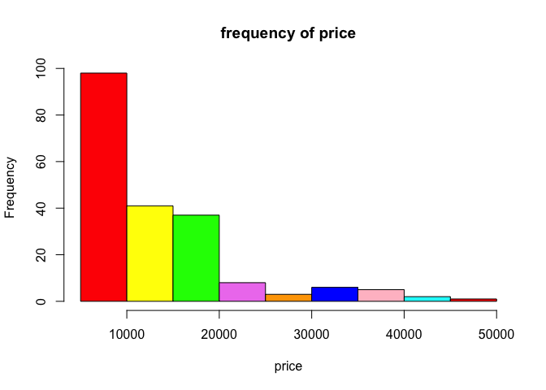
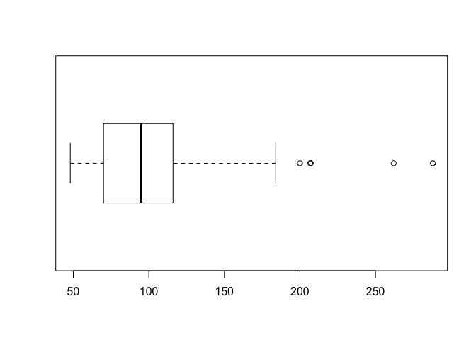
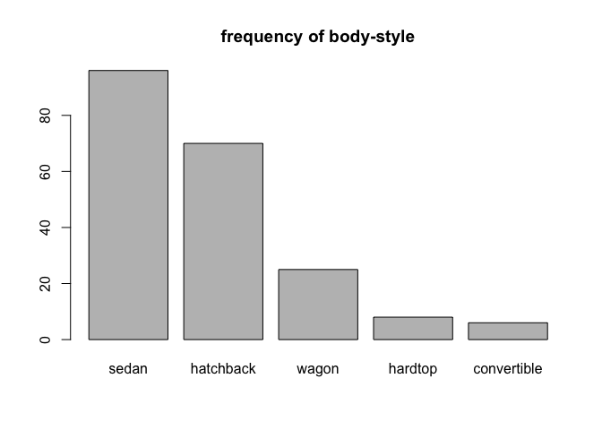
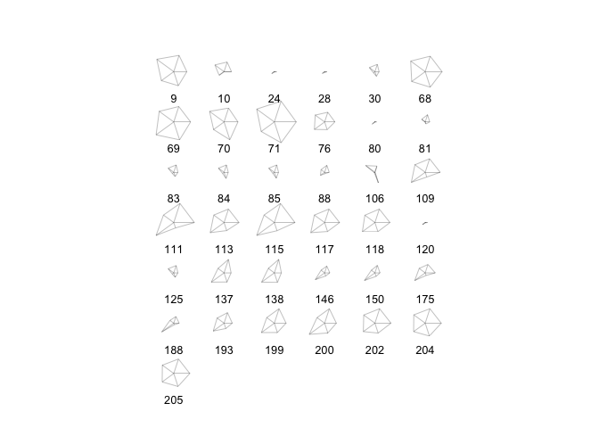
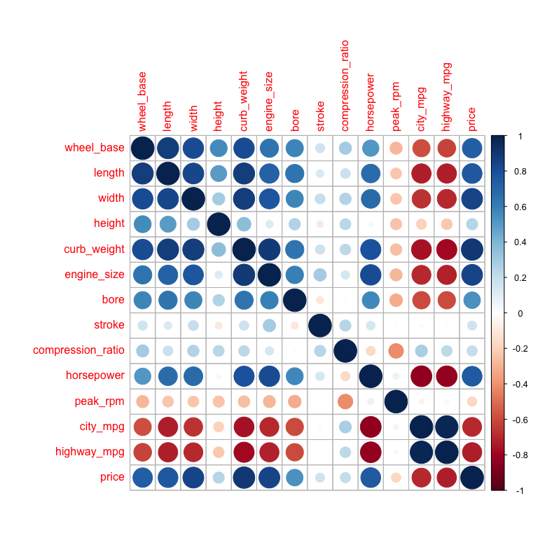
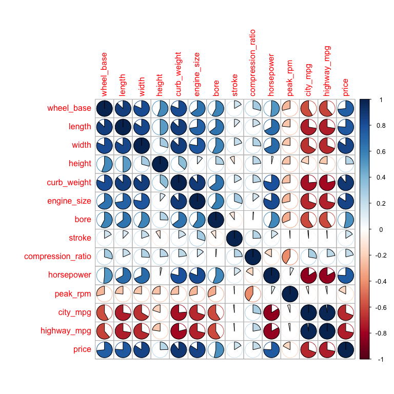
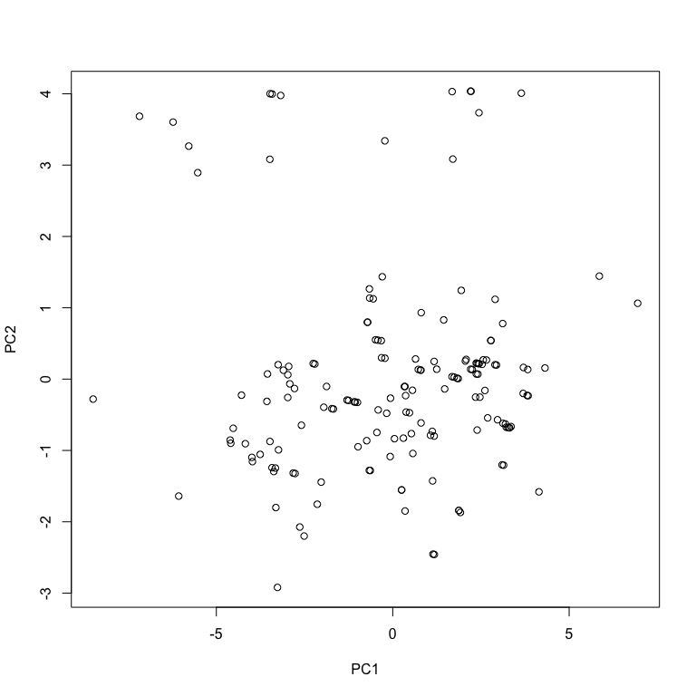
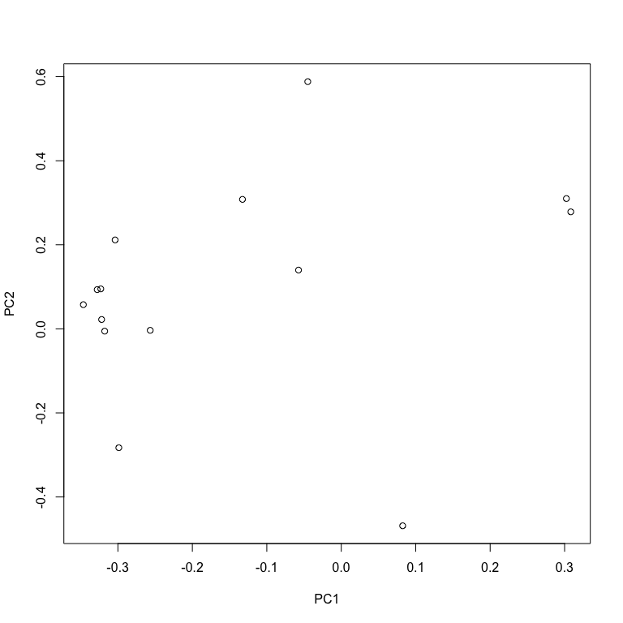
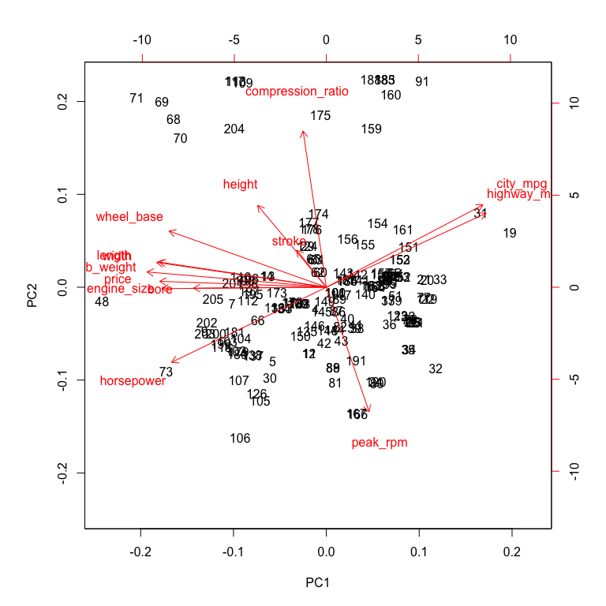

hw01-jilin-cao
================
caojilin
2/18/2018

### Data Import

``` r
column_names = c("symboling"  
,"normalized_losses"
,"make"
,"fuel_type"       
, "aspiration"      
, "num_of_doors"   
, "body_style"      
, "drive_wheels"    
, "engine_location" 
, "wheel_base"
, "length"          
, "width"           
, "height"          
, "curb_weight"     
, "engine_type"    
, "num_of_cylinders"
, "engine_size"
, "fuel_system"
, "bore"
, "stroke"         
, "compression_ratio"
, "horsepower"     
, "peak_rpm"      
, "city_mpg"        
, "highway_mpg"     
, "price")
column_types = c('real'
,'real'
,'character'
,'character'
,'character'
,'character'
,'character'
,'character'
,'character'
,'real'
,'real'
,'real'
,'real'
,'integer'
,'character'
,'character'
,'integer'
,'character'
,'real'
,'real'
,'real'
,'integer'
,'integer'
,'integer'
,'integer'
,'integer')
library(readr)

column_types1=c(symboling = col_double(),
  normalized_losses = col_double(),
  make = col_character(),
  fuel_type = col_character(),
  aspiration = col_character(),
  num_of_doors = col_character(),
  body_style = col_character(),
  drive_wheels = col_character(),
  engine_location = col_character(),
  wheel_base = col_double(),
  length = col_double(),
  width = col_double(),
  height = col_double(),
  curb_weight = col_integer(),
  engine_type = col_character(),
  num_of_cylinders = col_character(),
  engine_size = col_integer(),
  fuel_system = col_character(),
  bore = col_double(),
  stroke = col_double(),
  compression_ratio = col_double(),
  horsepower = col_integer(),
  peak_rpm = col_integer(),
  city_mpg = col_integer(),
  highway_mpg = col_integer(),
  price = col_character())

dat = read.csv('imports-85.data',header=FALSE,stringsAsFactors=FALSE,col.names = column_names,colClasses = column_types,na.strings = '?')
str(dat,vec.len=1)
```

    ## 'data.frame':    205 obs. of  26 variables:
    ##  $ symboling        : num  3 3 ...
    ##  $ normalized_losses: num  NA NA ...
    ##  $ make             : chr  "alfa-romero" ...
    ##  $ fuel_type        : chr  "gas" ...
    ##  $ aspiration       : chr  "std" ...
    ##  $ num_of_doors     : chr  "two" ...
    ##  $ body_style       : chr  "convertible" ...
    ##  $ drive_wheels     : chr  "rwd" ...
    ##  $ engine_location  : chr  "front" ...
    ##  $ wheel_base       : num  88.6 88.6 ...
    ##  $ length           : num  169 ...
    ##  $ width            : num  64.1 64.1 ...
    ##  $ height           : num  48.8 48.8 ...
    ##  $ curb_weight      : int  2548 2548 ...
    ##  $ engine_type      : chr  "dohc" ...
    ##  $ num_of_cylinders : chr  "four" ...
    ##  $ engine_size      : int  130 130 ...
    ##  $ fuel_system      : chr  "mpfi" ...
    ##  $ bore             : num  3.47 3.47 ...
    ##  $ stroke           : num  2.68 2.68 ...
    ##  $ compression_ratio: num  9 9 ...
    ##  $ horsepower       : int  111 111 ...
    ##  $ peak_rpm         : int  5000 5000 ...
    ##  $ city_mpg         : int  21 21 ...
    ##  $ highway_mpg      : int  27 27 ...
    ##  $ price            : int  13495 16500 ...

``` r
dat1 = read_csv('imports-85.data',col_names = column_names,col_types = column_types1,na = c('?'))
str(dat1,vec.len=1)
```

    ## Classes 'tbl_df', 'tbl' and 'data.frame':    205 obs. of  26 variables:
    ##  $ symboling        : int  3 3 ...
    ##  $ normalized_losses: int  NA NA ...
    ##  $ make             : chr  "alfa-romero" ...
    ##  $ fuel_type        : chr  "gas" ...
    ##  $ aspiration       : chr  "std" ...
    ##  $ num_of_doors     : chr  "two" ...
    ##  $ body_style       : chr  "convertible" ...
    ##  $ drive_wheels     : chr  "rwd" ...
    ##  $ engine_location  : chr  "front" ...
    ##  $ wheel_base       : num  88.6 88.6 ...
    ##  $ length           : num  169 ...
    ##  $ width            : num  64.1 64.1 ...
    ##  $ height           : num  48.8 48.8 ...
    ##  $ curb_weight      : int  2548 2548 ...
    ##  $ engine_type      : chr  "dohc" ...
    ##  $ num_of_cylinders : chr  "four" ...
    ##  $ engine_size      : int  130 130 ...
    ##  $ fuel_system      : chr  "mpfi" ...
    ##  $ bore             : num  3.47 3.47 ...
    ##  $ stroke           : num  2.68 2.68 ...
    ##  $ compression_ratio: num  9 9 ...
    ##  $ horsepower       : int  111 111 ...
    ##  $ peak_rpm         : int  5000 5000 ...
    ##  $ city_mpg         : int  21 21 ...
    ##  $ highway_mpg      : int  27 27 ...
    ##  $ price            : int  13495 16500 ...
    ##  - attr(*, "spec")=List of 2
    ##   ..$ cols   :List of 26
    ##   .. ..$ symboling        : list()
    ##   .. .. ..- attr(*, "class")= chr  "collector_integer" ...
    ##   .. ..$ normalized_losses: list()
    ##   .. .. ..- attr(*, "class")= chr  "collector_integer" ...
    ##   .. ..$ make             : list()
    ##   .. .. ..- attr(*, "class")= chr  "collector_character" ...
    ##   .. ..$ fuel_type        : list()
    ##   .. .. ..- attr(*, "class")= chr  "collector_character" ...
    ##   .. ..$ aspiration       : list()
    ##   .. .. ..- attr(*, "class")= chr  "collector_character" ...
    ##   .. ..$ num_of_doors     : list()
    ##   .. .. ..- attr(*, "class")= chr  "collector_character" ...
    ##   .. ..$ body_style       : list()
    ##   .. .. ..- attr(*, "class")= chr  "collector_character" ...
    ##   .. ..$ drive_wheels     : list()
    ##   .. .. ..- attr(*, "class")= chr  "collector_character" ...
    ##   .. ..$ engine_location  : list()
    ##   .. .. ..- attr(*, "class")= chr  "collector_character" ...
    ##   .. ..$ wheel_base       : list()
    ##   .. .. ..- attr(*, "class")= chr  "collector_double" ...
    ##   .. ..$ length           : list()
    ##   .. .. ..- attr(*, "class")= chr  "collector_double" ...
    ##   .. ..$ width            : list()
    ##   .. .. ..- attr(*, "class")= chr  "collector_double" ...
    ##   .. ..$ height           : list()
    ##   .. .. ..- attr(*, "class")= chr  "collector_double" ...
    ##   .. ..$ curb_weight      : list()
    ##   .. .. ..- attr(*, "class")= chr  "collector_integer" ...
    ##   .. ..$ engine_type      : list()
    ##   .. .. ..- attr(*, "class")= chr  "collector_character" ...
    ##   .. ..$ num_of_cylinders : list()
    ##   .. .. ..- attr(*, "class")= chr  "collector_character" ...
    ##   .. ..$ engine_size      : list()
    ##   .. .. ..- attr(*, "class")= chr  "collector_integer" ...
    ##   .. ..$ fuel_system      : list()
    ##   .. .. ..- attr(*, "class")= chr  "collector_character" ...
    ##   .. ..$ bore             : list()
    ##   .. .. ..- attr(*, "class")= chr  "collector_double" ...
    ##   .. ..$ stroke           : list()
    ##   .. .. ..- attr(*, "class")= chr  "collector_double" ...
    ##   .. ..$ compression_ratio: list()
    ##   .. .. ..- attr(*, "class")= chr  "collector_double" ...
    ##   .. ..$ horsepower       : list()
    ##   .. .. ..- attr(*, "class")= chr  "collector_integer" ...
    ##   .. ..$ peak_rpm         : list()
    ##   .. .. ..- attr(*, "class")= chr  "collector_integer" ...
    ##   .. ..$ city_mpg         : list()
    ##   .. .. ..- attr(*, "class")= chr  "collector_integer" ...
    ##   .. ..$ highway_mpg      : list()
    ##   .. .. ..- attr(*, "class")= chr  "collector_integer" ...
    ##   .. ..$ price            : list()
    ##   .. .. ..- attr(*, "class")= chr  "collector_integer" ...
    ##   ..$ default: list()
    ##   .. ..- attr(*, "class")= chr  "collector_guess" ...
    ##   ..- attr(*, "class")= chr "col_spec"

### 3) Technical Questions about importing data (10 pts)

Answer the following questions (using your own words). You do NOT need to include any commands.

a.If you don’t provide a vector of column names, what happens to the column names of the imported data when you simply invoke read.csv('imports-85.data')?

   It's going to use the first row as the column names. If a columns consits of numbers, 'X' will appear ahead the numbers. Like 'X1, X2'

b.If you don’t provide a vector of column names, what happens to the column names of the imported data when you invoke read.csv('imports-85.data', header = FALSE)?

   It will use V1,V2,V3...as column names.

c.When using the reading table functions, if you don’t specify how missing values are codified, what happens to the data type of those columns that contain '?', e.g. price or num\_of\_doors?

   If I specified the data type for each column, like assign price as 'real',then it would be an error if I call read table when it encounters "?". If I don't assign data type for columns, it will keep '?', it will be harder to manipulate data later.

d.Say you import imports-85.data in two different ways. In the first option you import the data without specifying the data type of each column. In the second option you do specify the data types. You may wonder whether both options return a data frame of the same memory size. You can actually use the function object.size() that provides an estimate of the memory that is being used to store an R object. Why is the data frame imported in the second option bigger (in terms of bytes) than the data frame imported in the first option?

   Without specifying data type for columns, reading tables will convert all characters as factors ,and factors store as integers, and integers takes less spaces

e.Say the object dat is the data frame produced when importing imports-85.data.What happens to the data values if you convert dat as an R matrix?

   R matrix require elements have same data type. So I tested and got a matrix with all elements converted to strings.

### 4) Plotting

``` r
colors = c("red", "yellow", "green", "violet", "orange", "blue", "pink", "cyan") 
hist(dat$price,col=colors,main='frequency of price',xlab='price')
```



``` r
# This histogram shows that the frequency of car price mostly concentrates on 5000 to 20000. Which makes sence because most cars are purchased by normal people. They are affordable, so not very expensive.
```

``` r
boxplot(dat$horsepower,horizontal=TRUE)
```



``` r
# From this graph we can see the horsepower mainly are centered at 100. There are some exceptions, which probably are sportscar with high horsepower.

barplot(sort(table(dat$body_style),decreasing=TRUE),main='frequency of body-style')
```



``` r
# We can see that sedan is the most frequent body style, and the convertible is the least. Which accord with the reality. This graph gives us a clear view of the frequency of body-style in decreasing order.

stars(dat[dat$aspiration == 'turbo',c('wheel_base','length','width','height','price')])
```



``` r
# How do we interpret this?
```

5)Summaries (10 pts) Use R code to answer the following questions:

a.What is the mean price of fuel\_type gas cars? And what is the mean price of fuel\_type diesel cars? (removing missing values)

``` r
mean(dat[dat$fuel_type=='gas','price'],na.rm = TRUE)
```

    ## [1] 12916.41

``` r
mean(dat[dat$fuel_type=='diesel','price'],na.rm = TRUE)
```

    ## [1] 15838.15

b.What is the make of the car with twelve num\_of\_cylinders?

``` r
dat[dat$num_of_cylinders=='twelve','make']
```

    ## [1] "jaguar"

c.What is the make that has the most diesel cars?

``` r
getmode <- function(v) {
   uniqv <- unique(v)
   uniqv[which.max(tabulate(match(v, uniqv)))]
}
getmode(dat[dat$fuel_type=='diesel','make'])
```

    ## [1] "peugot"

d.What is the price of the car with the largest amount of horsepower?

``` r
df = dat[dat$horsepower==max(dat$horsepower,na.rm = TRUE),'price']
df
```

    ## [1] NA NA NA

e.What is the bottom 10th percentile of city\_mpg?

``` r
quantile(sort(dat$city_mpg,decreasing = FALSE), .10)
```

    ## 10% 
    ##  17

f.What is the top 10th percentile of highway\_mpg?

``` r
quantile(dat$highway_mpg, c(.90))
```

    ## 90% 
    ##  38

g.What is the median price of those cars in the bottom 10th percentile of city\_mpg?

``` r
median(dat[dat$city_mpg <= 17,'price'],na.rm=TRUE)
```

    ## [1] 32250

6)Technical Questions about data frames (10 pts)
Answer the following questions (using your own words). You do NOT need to include any commands.

a.What happens when you use the dollar $ operator on a data frame, attempting to use the name of a column that does not exist? For example: dat$xyz where there is no column named xyz.
    It returns NULL

b.Which of the following commands fails to return the vector mpg which is a column in the built-in data frame mtcars: 1. mtcars$mpg 2. mtcars\[ ,1\] 3. mtcars\[\[1\]\] 4. mtcars\[ ,mpg\] 5. mtcars\[\["mpg"\]\] 6. mtcars$"mpg" 7. mtcars\[ ,"mpg"\]

    number 4 doesn't work

c.Based on your answer for part (b), what is the reason that makes such command to fail?
    To refer a column, the name needs a "". For example, mtcars\[,'mpg'\], or just use the number of column, like mtcars\[,1\]

d.Can you include an R list as a “column” of a data frame? YES or NO, and why.
   Yes, data frame is actually a list. We use cbind function to create a data frame, which could combine two list into a data frame.

e.What happens when you apply as.list() to a data frame? e.g. as.list(mtcars)
    \# It converts a data frame into a list of individual data frame objects for each column. When I called 'class' function on mtcars and as.list(mtcars), the former one gives me 'data.frame',the later one gives me 'list'.

f.Consider the command: abc &lt;- as.list(mtcars). What function(s) can you use to convert the object abc into a data frame?

    Use the function "data.frame()"

7 and 8) Correlations of quantitative variables and Principal Components Analysis

``` r
qdat = na.omit(dat)
qdat = qdat[,c( "wheel_base"
, "length"                          
, "width"                           
, "height"                          
, "curb_weight"                                     
, "engine_size"                         
, "bore"                
, "stroke"                      
, "compression_ratio"               
, "horsepower"                  
, "peak_rpm"                    
, "city_mpg"                        
, "highway_mpg"                     
, "price")]
library(corrplot)
```

    ## corrplot 0.84 loaded

``` r
corrplot(cor(qdat),method="circle")
```



``` r
# This is a circle pattern graph. The correlation's range is from -1 to 1 indicated by the color red and blue. For example, 'length' and 'weight' have a strong relationship, but 'length' and 'city_mpg' doesn't not have.
corrplot(cor(qdat),method="pie")
```



``` r
# This is a pie pattern graph. It's similar to the previous one, instead of a 'circle', it uses a 'pie' indicating correlation. This graph is more specific and clear than 'circle', since from each 'pie' we could see how much two variables are ralated.

pca_prcomp = prcomp(qdat,scale. = TRUE)

eigenvalues = pca_prcomp$sdev^2

loadings = pca_prcomp$rotation
round(loadings,3)
```

    ##                      PC1    PC2    PC3    PC4    PC5    PC6    PC7    PC8
    ## wheel_base        -0.304  0.212 -0.099  0.232 -0.033  0.135 -0.469  0.079
    ## length            -0.328  0.093 -0.107  0.159 -0.035  0.115 -0.226 -0.063
    ## width             -0.323  0.095  0.088  0.033  0.204  0.025 -0.479 -0.001
    ## height            -0.133  0.308 -0.480  0.538 -0.256 -0.149  0.403  0.199
    ## curb_weight       -0.346  0.058  0.045 -0.009  0.094 -0.094  0.154  0.064
    ## engine_size       -0.318 -0.005  0.241 -0.229 -0.032 -0.152  0.213  0.286
    ## bore              -0.257 -0.004 -0.257 -0.380 -0.203  0.771  0.175  0.060
    ## stroke            -0.057  0.140  0.710  0.275 -0.577  0.149  0.038 -0.046
    ## compression_ratio -0.045  0.588  0.204  0.015  0.479  0.168  0.344 -0.454
    ## horsepower        -0.299 -0.283  0.150 -0.074  0.063 -0.028  0.312  0.176
    ## peak_rpm           0.082 -0.469  0.128  0.589  0.391  0.428  0.106  0.098
    ## city_mpg           0.302  0.310  0.081 -0.043  0.124  0.139 -0.049  0.475
    ## highway_mpg        0.308  0.278  0.083 -0.050  0.065  0.164 -0.074  0.501
    ## price             -0.322  0.022  0.126 -0.015  0.317 -0.197  0.038  0.369
    ##                      PC9   PC10   PC11   PC12   PC13   PC14
    ## wheel_base        -0.050  0.584  0.001 -0.451 -0.043 -0.064
    ## length             0.605  0.031  0.171  0.590 -0.089  0.160
    ## width             -0.096 -0.727 -0.187 -0.172 -0.056 -0.029
    ## height            -0.079 -0.228 -0.052 -0.069 -0.106 -0.012
    ## curb_weight        0.052  0.063 -0.237  0.069  0.867 -0.102
    ## engine_size        0.111  0.171 -0.646  0.074 -0.416 -0.009
    ## bore              -0.217 -0.068  0.027  0.041  0.000  0.007
    ## stroke            -0.126 -0.068  0.112  0.049  0.051  0.022
    ## compression_ratio  0.047  0.051  0.031 -0.074 -0.125 -0.036
    ## horsepower         0.446 -0.123  0.428 -0.518 -0.043  0.036
    ## peak_rpm          -0.033  0.043 -0.211  0.070 -0.024 -0.016
    ## city_mpg           0.096 -0.030 -0.055 -0.094  0.144  0.706
    ## highway_mpg        0.242 -0.066  0.083  0.070  0.015 -0.675
    ## price             -0.518  0.097  0.456  0.327 -0.101  0.024

``` r
scores = pca_prcomp$x
round(head(scores),3)
```

    ##       PC1    PC2    PC3   PC4    PC5    PC6    PC7    PC8    PC9   PC10
    ## 4  -0.413 -0.432  0.403 1.120  0.124  0.051 -0.262 -0.193 -0.148 -0.076
    ## 5  -2.028 -1.444  0.528 0.948 -0.018 -0.743  0.187 -0.442 -0.540  0.110
    ## 7  -3.567 -0.312  0.246 1.856  0.376 -0.330 -1.730 -0.069 -0.012 -1.132
    ## 9  -4.607 -0.855  0.422 1.985  0.730 -0.954 -1.292 -0.042 -0.290 -1.093
    ## 11 -0.637 -1.282 -1.393 0.554  1.124  0.750  0.076  0.187 -0.396  0.739
    ## 12 -0.664 -1.280 -1.383 0.552  1.151  0.733  0.079  0.218 -0.440  0.747
    ##      PC11   PC12   PC13   PC14
    ## 4   0.425  0.095 -0.266 -0.001
    ## 5  -0.018  0.266  0.065  0.078
    ## 7  -0.316  0.156 -0.268 -0.069
    ## 9   0.510 -0.020  0.026  0.232
    ## 11  0.390  0.289 -0.270 -0.046
    ## 12  0.428  0.316 -0.278 -0.044

``` r
#Examine the eigenvalues and determine the proportion of variation that is “captured”
#by the first three components.
eigenvalues
```

    ##  [1] 7.78036168 2.04609771 1.31815775 0.88723082 0.56546244 0.39095199
    ##  [7] 0.27618337 0.22164907 0.14783726 0.12214670 0.08942773 0.08612020
    ## [13] 0.04580215 0.02257113

``` r
proportion = sum(head(eigenvalues,3))/sum(eigenvalues)
proportion
```

    ## [1] 0.7960441

``` r
#components
plot(scores[,1],scores[,2],xlab="PC1",ylab = 'PC2')
```



``` r
#rotation
#use the first two loadings (i.e. eigenvectors) 
plot(loadings[,1],loadings[,2],xlab = 'PC1',ylab = 'PC2')
```



``` r
biplot(pca_prcomp)
```


