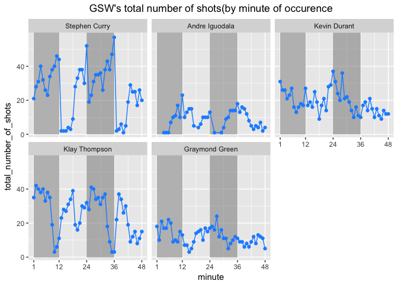

HW 02 - Shot Charts
================
caojilin
3/3/2018

### 5

``` r
source(file = '../code/make-shots-data-script.R')
library(ggplot2)
library(dplyr)
```

    ## 
    ## Attaching package: 'dplyr'

    ## The following objects are masked from 'package:stats':
    ## 
    ##     filter, lag

    ## The following objects are masked from 'package:base':
    ## 
    ##     intersect, setdiff, setequal, union

``` r
# name_list = c('Angre Iguodala','Draymond Green','Kevin Durant','Klay Thompson','Stephen Curry')
# total_list = c(length(Angre$shot_made_flag),length(Green$shot_made_flag),length(Durant$shot_made_flag),length(Klay$shot_made_flag),length(Curry$shot_made_flag))
# total_shot_table = data.frame(name=name_list,total=total_list)
# total_shot_table = arrange(total_shot_table,desc(total))

shot_table = arrange(summarise(group_by(shots_data,name),total=n()),desc(total))
shot_table
```

    ## # A tibble: 5 x 2
    ##   name           total
    ##   <fct>          <int>
    ## 1 Stephen Curry   1250
    ## 2 Klay Thompson   1220
    ## 3 Kevin Durant     915
    ## 4 Graymond Green   578
    ## 5 Andre Iguodala   371

``` r
#5.2
total_effective_shot = shots_data %>%
                    group_by(name) %>%
                    summarise(total = n(),
                              made = sum(shot_made_flag=='made shot')) %>%
                    mutate(perc_made = made/total) %>%
                    arrange(desc(perc_made))
total_effective_shot
```

    ## # A tibble: 5 x 4
    ##   name           total  made perc_made
    ##   <fct>          <int> <int>     <dbl>
    ## 1 Kevin Durant     915   495     0.541
    ## 2 Andre Iguodala   371   192     0.518
    ## 3 Klay Thompson   1220   575     0.471
    ## 4 Stephen Curry   1250   584     0.467
    ## 5 Graymond Green   578   245     0.424

``` r
points2_effective_shot = shots_data %>%
                    group_by(name) %>%
                    summarise(total = sum(shot_type=='2PT Field Goal'),
                              made = sum(shot_made_flag=='made shot'
                              & shot_type=='2PT Field Goal')) %>%
                    mutate(perc_made = made/total) %>%
                    arrange(desc(perc_made))
points2_effective_shot
```

    ## # A tibble: 5 x 4
    ##   name           total  made perc_made
    ##   <fct>          <int> <int>     <dbl>
    ## 1 Andre Iguodala   210   134     0.638
    ## 2 Kevin Durant     643   390     0.607
    ## 3 Stephen Curry    563   304     0.540
    ## 4 Klay Thompson    640   329     0.514
    ## 5 Graymond Green   346   171     0.494

``` r
points3_effective_shot = shots_data %>%
                    group_by(name) %>%
                    summarise(total = sum(shot_type=='3PT Field Goal'),
                              made = sum(shot_made_flag=='made shot'
                                         & shot_type=='3PT Field Goal')) %>%
                    mutate(perc_made = made/total) %>%
                    arrange(desc(perc_made))
points3_effective_shot
```

    ## # A tibble: 5 x 4
    ##   name           total  made perc_made
    ##   <fct>          <int> <int>     <dbl>
    ## 1 Klay Thompson    580   246     0.424
    ## 2 Stephen Curry    687   280     0.408
    ## 3 Kevin Durant     272   105     0.386
    ## 4 Andre Iguodala   161    58     0.360
    ## 5 Graymond Green   232    74     0.319

### 6.1

``` r
shot_by_distance_table = shots_data %>%
                      group_by(shot_distance) %>%
                      summarise(made_shot_prop = sum(shot_made_flag=='made shot')/n())
#6.2
#title centered
ggplot(data=shot_by_distance_table,aes(x=shot_distance,y=made_shot_prop))+geom_point(aes(color=shot_distance))+scale_x_continuous(breaks=pretty(shot_by_distance_table$shot_distance,n=10))+scale_y_continuous(breaks=pretty(shot_by_distance_table$made_shot_prop,n=10))+theme_update(plot.title = element_text(hjust = 0.5))+ggtitle('shot_distance_distribution')
```

 \#Observation
\# Shots at distances less than 30 have high chance to make it, and shots longer than 35 has a lower chance to make it.
\# Basically the closer the shot to the basket, the higher the chance to make a successful shot.
\# I can conform the statement above.
\# From the graph, I guess the threadhold is 35 inches.
\# Distances less than 30 inches tend to have a 50% chance making a shot.

### 7

``` r
shots_by_minute_table = shots_data %>%
                          group_by(name,minute) %>%
                          summarise(total_number_of_shots=n())
  
ggplot(data = filter(shots_by_minute_table,name=='Stephen Curry'),
      aes(x=minute,y=total_number_of_shots)) +geom_point(color='dodgerblue') + scale_x_continuous(breaks=c(1,12,24,36,48)) + geom_path(color='dodgerblue') + 
  ggtitle("Stephen Curry's total number of shots(by minute of occurence")+theme_update(plot.title=element_text(hjust=0.5))
```


``` r
shade = data.frame(x1=c(1,24), x2=c(12,36), y1=c(0,80), y2=c(0,80))

ggplot(data = shots_by_minute_table,aes(x=minute,y=total_number_of_shots))+
  geom_rect(xmin=1,xmax=12,ymin=0,ymax=80,fill='gray')+
  geom_rect(xmin=24,xmax=36,ymin=0,ymax=80,fill='gray',alpha=0.02)+
  geom_point(color='dodgerblue') + facet_wrap(~ name)+scale_x_continuous(breaks=c(1,12,24,36,48)) + geom_path(color='dodgerblue') + theme_minimal()+ggtitle("GSW's total number of shots(by minute of occurence")+theme_update(plot.title=element_text(hjust=0.5))
```


