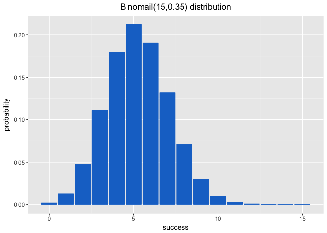

Hw03-jilin-cao
================
caojilin
3/16/2018

``` bash

cut -d "," -f 2 nba2017-roster.csv | tail +2 | sort -u> team-names.txt
head -5 team-names.txt
```

    ## "ATL"
    ## "BOS"
    ## "BRK"
    ## "CHI"
    ## "CHO"

``` bash
cut -d "," -f 3 nba2017-roster.csv | tail +2 | sort -u> position-names.txt
cat position-names.txt
```

    ## "C"
    ## "PF"
    ## "PG"
    ## "SF"
    ## "SG"

``` bash
# I feel like "tail +2" ignores the first row and return rest of the table.
cut -d "," -f 7 nba2017-roster.csv | tail +2| sort -n |uniq -c > experience-counts.txt
head -5 experience-counts.txt
```

    ##   80 0
    ##   52 1
    ##   46 2
    ##   36 3
    ##   35 4

``` bash
grep -E "LAC|team" nba2017-roster.csv > LAC.csv

cat LAC.csv

# No first row?
```

    ## "player","team","position","height","weight","age","experience","salary"
    ## "Alan Anderson","LAC","SF",78,220,34,7,1315448
    ## "Austin Rivers","LAC","SG",76,200,24,4,1.1e+07
    ## "Blake Griffin","LAC","PF",82,251,27,6,20140838
    ## "Brandon Bass","LAC","PF",80,250,31,11,1551659
    ## "Brice Johnson","LAC","PF",82,230,22,0,1273920
    ## "Chris Paul","LAC","PG",72,175,31,11,22868828
    ## "DeAndre Jordan","LAC","C",83,265,28,8,21165675
    ## "Diamond Stone","LAC","C",83,255,19,0,543471
    ## "J.J. Redick","LAC","SG",76,190,32,10,7377500
    ## "Jamal Crawford","LAC","SG",77,200,36,16,13253012
    ## "Luc Mbah a Moute","LAC","SF",80,230,30,8,2203000
    ## "Marreese Speights","LAC","C",82,255,29,8,1403611
    ## "Paul Pierce","LAC","SF",79,235,39,18,3500000
    ## "Raymond Felton","LAC","PG",73,205,32,11,1551659
    ## "Wesley Johnson","LAC","SF",79,215,29,6,5628000

``` bash
cut -d "," -f 6 LAC.csv |sort -n|uniq -c
```

    ##    1 "age"
    ##    1 19
    ##    1 22
    ##    1 24
    ##    1 27
    ##    1 28
    ##    2 29
    ##    1 30
    ##    2 31
    ##    2 32
    ##    1 34
    ##    1 36
    ##    1 39

``` bash
grep "CLE" nba2017-roster.csv | wc -l
```

    ##       15

``` bash
cut -d "," -f -2,4-5 nba2017-roster.csv  |grep -E "GSW|team"  > gsw-height-weight.csv
cat  gsw-height-weight.csv
# still no first row
```

    ## "player","team","height","weight"
    ## "Andre Iguodala","GSW",78,215
    ## "Damian Jones","GSW",84,245
    ## "David West","GSW",81,250
    ## "Draymond Green","GSW",79,230
    ## "Ian Clark","GSW",75,175
    ## "James Michael McAdoo","GSW",81,230
    ## "JaVale McGee","GSW",84,270
    ## "Kevin Durant","GSW",81,240
    ## "Kevon Looney","GSW",81,220
    ## "Klay Thompson","GSW",79,215
    ## "Matt Barnes","GSW",79,226
    ## "Patrick McCaw","GSW",79,185
    ## "Shaun Livingston","GSW",79,192
    ## "Stephen Curry","GSW",75,190
    ## "Zaza Pachulia","GSW",83,270

``` bash

grep "player" nba2017-roster.csv | cut -d "," -f 1,8 > top10-salaries.csv
cut -d "," -f -1,8 nba2017-roster.csv | sort -r -k2 -n -t, | head -10 >> top10-salaries.csv
cat top10-salaries.csv
#
#sed -i '' '1i\
#"player","salary"
#' top10-salaries.csv
```

    ## "player","salary"
    ## "LeBron James",30963450
    ## "Russell Westbrook",26540100
    ## "Mike Conley",26540100
    ## "Kevin Durant",26540100
    ## "James Harden",26540100
    ## "DeMar DeRozan",26540100
    ## "Al Horford",26540100
    ## "Carmelo Anthony",24559380
    ## "Damian Lillard",24328425
    ## "Dwyane Wade",23200000

1.Assume that the “successful” event is getting a “six” when rolling a die. Consider rolling a fair die 10 times. Use bin\_probability() to find the probability of getting exactly 3 sixes.

``` r
source('./code/binomial-functions.R')
bin_probability(10,3,1/6)
```

    ## [1] 0.1550454

2.Use bin\_distribution() to obtain the distribution of the number of “sixes” when rolling a loaded die 10 times, in which the number “six” has probability of 0.25. Make a plot of this distribution.

``` r
# a loaded die with probability of "6" is 0.25
# p("6") = 0.25
dist = bin_distribution(10,0.25)
plot(x=dist[[1]],y=dist[[2]],xlab='success',ylab='probability',pch=18, col="blue",main = "binomial distribution of Binomial(10,0.25) ",cex.lab=1.25)
axis(1,at = seq(0,10,by=1),labels = seq(0,10,by=1))
```


3.Use bin\_probability(), and a for loop, to obtain the probability of getting more than 3 heads in 5 tosses with a biased coin of 35% chance of heads.

``` r
prob = 0
for(i in 4:5){
  prob = prob + bin_probability(5,i,0.35)
}
prob
```

    ## [1] 0.0540225

4.Use bin\_distribution() to obtain the probability distribution of the number of heads when tossing a loaded coin 15 times, with 35% chance of heads. Make a plot of this distribution.

``` r
library(ggplot2)
success = 0:15
probability = rep(0,16)
dat = bin_distribution(15,0.35)

#color outside the aes()

ggplot(data = dat,aes(x=success,y=probability)) +geom_point(color='dodgerblue3')+
  scale_x_continuous(breaks=pretty(dat$success,n=15))+scale_y_continuous(breaks=pretty(dat$probability,n=10))+
  theme_update(plot.title = element_text(hjust = 0.5))+ggtitle('distribution of Binomial(15,0.35)')
```


``` r
ggplot(dat,aes(x=success,y=probability))+geom_bar(stat = 'identity',col='dodgerblue3',fill='dodgerblue3')+labs(title="Binomail(15,0.35) distribution")
```


