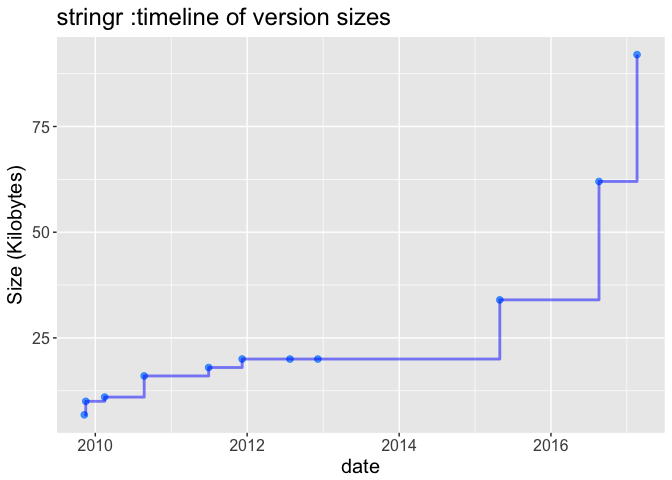
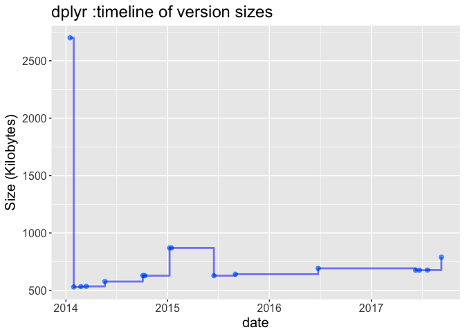
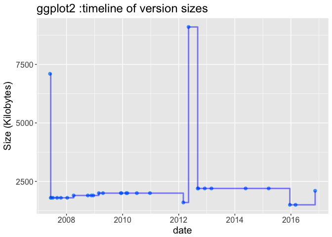
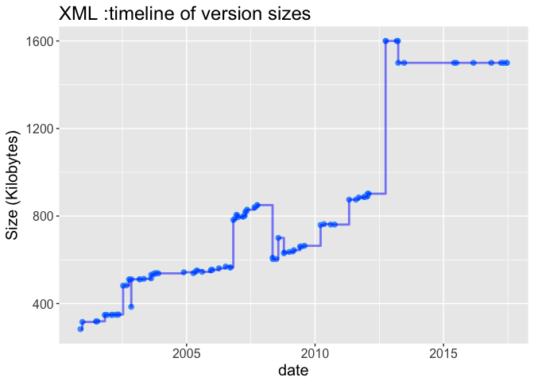
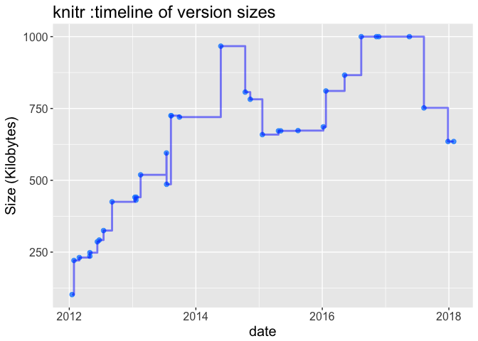
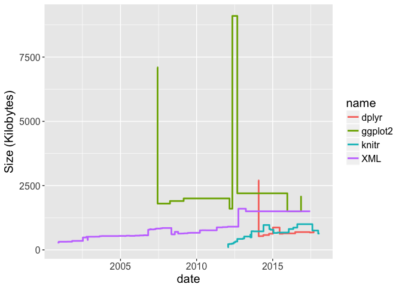
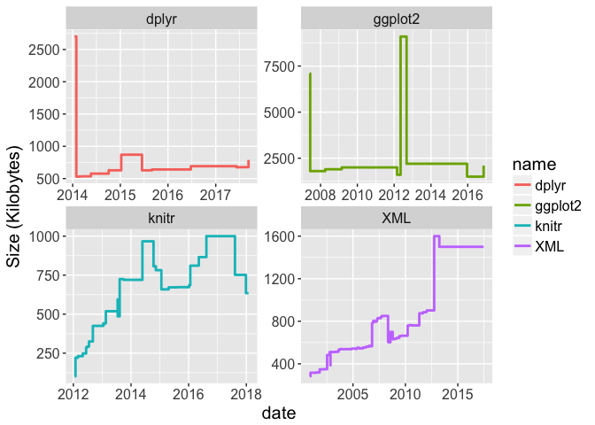
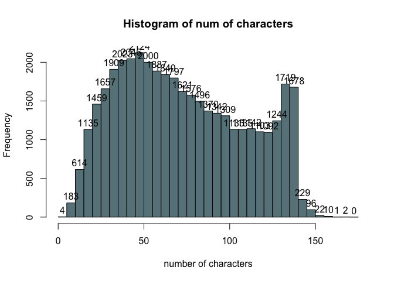
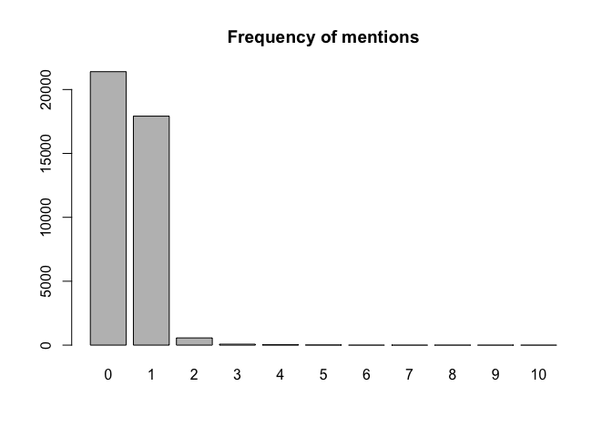
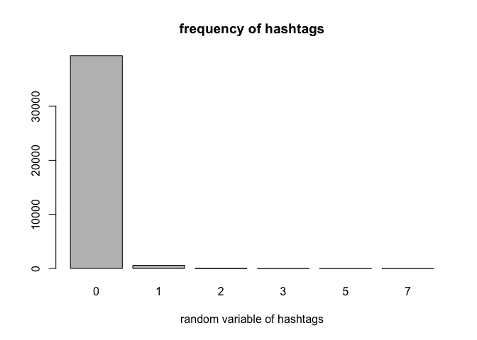

hw04-jilin-cao
================
caojilin
4/3/2018

1.4) Archive of "stringr"

``` r
raw_data <- read_archive('stringr')
clean_data <- clean_archive(raw_data)
plot_archive(clean_data)
```

 1.5) Archives of "splyr", "ggplot2", "XML", and "knitr"

``` r
raw_data <- read_archive("dplyr")
clean_data1 <- clean_archive(raw_data)
plot_archive(clean_data1)
```



``` r
raw_data <- read_archive("ggplot2")
clean_data2 <- clean_archive(raw_data)
plot_archive(clean_data2)
```



``` r
raw_data <- read_archive("XML")
clean_data3 <- clean_archive(raw_data)
plot_archive(clean_data3)
```



``` r
raw_data <- read_archive("knitr")
clean_data4 <- clean_archive(raw_data)
plot_archive(clean_data4)
```



``` r
dat = rbind(clean_data1,clean_data2,clean_data3,clean_data4)
#Plot all packages in one frame
ggplot(data=dat, aes(x=date,y=size),color="blue") + 
  scale_x_date() +geom_step(aes(color=name),size=1) +
  xlab("date")+ylab("Size (Kilobytes)")+theme(text = element_text(size=15))
```



``` r
#Plot one package per facet (with free scales)
ggplot(data=dat, aes(x=date,y=size),color="blue") + 
  scale_x_date() +geom_step(aes(color=name),size=1) +
    facet_wrap(~ name,scales = "free") +
    xlab("date")+ylab("Size (Kilobytes)")+theme(text = element_text(size=15))
```

 3) Data “Emotion in Text”

``` r
#Annoying stringasfactor when you need to manipulate.

tweet = read.csv("../data/text-emotion.csv",stringsAsFactors = FALSE,na.strings = "NA")
dat = data.frame(content = tweet$content,stringsAsFactors = FALSE)
```

3.1) Number of characters per tweet
===================================

``` r
#Use str_length.
dat["num_of_characters"]= str_length(dat$content)
summary(dat)
```

    ##    content          num_of_characters
    ##  Length:40000       Min.   :  1.00   
    ##  Class :character   1st Qu.: 43.00   
    ##  Mode  :character   Median : 69.00   
    ##                     Mean   : 73.41   
    ##                     3rd Qu.:103.00   
    ##                     Max.   :167.00

``` r
hist(dat$num_of_characters,breaks=seq(0,175,5),col="lightblue4",
     xlab = "number of characters",main="Histogram of num of characters",label=TRUE)
```

 \#3.2) Number of Mentions

``` r
#write functions to solve this problems

#check if a string starts with "@", a single "@ doesn't work at dat$content[82]"
is_start_with_at = function(str){
  #str = "@tiffanylue"
  if(str_length(str) <= 1){
    return(FALSE)
  }
  if(str_sub(str,start = 1,end = 1) == "@"){
    return(TRUE)
  }else{
    return(FALSE)
  }
}
#test
is_start_with_at("@abc")
```

    ## [1] TRUE

``` r
is_start_with_at("123")
```

    ## [1] FALSE

``` r
is_start_with_at("")
```

    ## [1] FALSE

``` r
is_valid_usename = function(str){
  #str = "@stat133"
  if(!is_start_with_at(str)){
    return(FALSE)
  }
  splited = str_split(str,pattern = "")[[1]]
  #ie "@" "s" "t" "a" "t" "1" "3" "3"
  #debugger
  splited = splited[2:length(splited)]
  for(i in splited){
    if (i == "_" || is.element(i,letters) ||      
        is.element(i,LETTERS) || !is.na(suppressWarnings(as.numeric(i))) ){
        #pass
    }else{
      return(FALSE)
    } 
  }
  return(TRUE)
}
#test
is_valid_usename("@stat133")
```

    ## [1] TRUE

``` r
is_valid_usename("10am?")
```

    ## [1] FALSE

``` r
is_valid_usename("&amp;%@#$ˆ&amp")
```

    ## [1] FALSE

``` r
is_valid_usename("@123qa@123")
```

    ## [1] FALSE

``` r
#expeted False, since @ cannot be in a name 
is_valid_usename("")
```

    ## [1] FALSE

``` r
#expeted False

#In one sentence
check_at_in_sentence = function(str){
  splited = str_split(str,pattern = " ")
  #initialize
  vec = splited[[1]]
  num = 0
  for(i in vec){
        if(is_valid_usename(i)){
            num = num + 1
        }
    }
  return(num)
}
check_at_in_vec = function(vec){
  new_vec = c()
  for(i in vec){
    num = check_at_in_sentence(i)
    new_vec = c(new_vec,num)
  }
  return(new_vec)
}
# work done
dat["num_of_mention"] = check_at_in_vec(dat$content)
#barplot
barplot(table(dat$num_of_mention),main = "Frequency of mentions")
```



``` r
#display contents with 10 mentions
dat[dat$num_of_mention == 10,"content"]
```

    ## [1] "last #ff  @Mel_Diesel @vja4041 @DemonFactory @shawnmcguirt @SEO_Web_Design @ChuckSwanson @agracing @confidentgolf @tluckow @legalblonde31"

3.3) Hashtags

``` r
#Hashtags cannot contain spaces or punctuation symbols, and cannot start with or use only numbers.

is_start_with_hashtag = function(str){
  if(str_sub(str,1,1) == "#"){
    return(TRUE)
  }else{
    return(FALSE)
  }
}

is_valid_hashtag = function(str){
  if(!is_start_with_hashtag(str)){
    return(FALSE)
  }
  #check if all number like #123445 #abcde
  if(!is.na(suppressWarnings(as.numeric(str_sub(str,2))))){
    return(FALSE)
  }
  #str_split returns a list
  splited = str_split(str,pattern = "")[[1]]
  #get rid of #
  splited = splited[2:length(splited)]
  #check starts with number, use is.na(as.numeric("str"))
  if(suppressWarnings(!is.na(as.numeric(splited[1])))){
    return(FALSE)
  }
  #now it also could be #@^abc123 or #a3bc123 or #123456
  for(i in splited){
    if(is.element(i,letters) || is.element(i,LETTERS) || 
      !is.na(suppressWarnings(as.numeric(i)))){
      #pass
    }else{
      return(FALSE)
    }
  }
  
  return(TRUE)
}
#test
is_valid_hashtag("#beer")
```

    ## [1] TRUE

``` r
is_valid_hashtag("#123")
```

    ## [1] FALSE

``` r
is_valid_hashtag("#1abc")
```

    ## [1] FALSE

``` r
is_valid_hashtag("bac")
```

    ## [1] FALSE

``` r
is_valid_hashtag("#$abc123")
```

    ## [1] FALSE

``` r
detect_hashtag_in_sentence = function(str){
  num = 0
  splited = str_split(str, pattern = " ")[[1]]
  
  for(i in splited){
    if(is_valid_hashtag(i)){
      num = num + 1
    }
  }
  return(num)
}

detect_hashtag = function(vec){
  num_vec = c()
  for(i in vec){
    num = detect_hashtag_in_sentence(i)
    num_vec = c(num_vec,num)
  }
  return(num_vec)
}

#Count the number of hashtags in the tweet contents
dat["count_of_hashtags"] = detect_hashtag(dat$content)

#Display such frequencies, and make a barplot of these counts
barplot(table(dat$count_of_hashtags),main = "frequency of hashtags",xlab = "random variable of hashtags")
```



``` r
#What is the average length of the hashtags?
mean(dat$count_of_hashtags)
```

    ## [1] 0.018925

What is the most common length (i.e. the mode) of the hashtags?

``` r
table(dat$count_of_hashtags)
```

    ## 
    ##     0     1     2     3     5     7 
    ## 39331   601    54    12     1     1

we can see from the table that the most common length is 0
