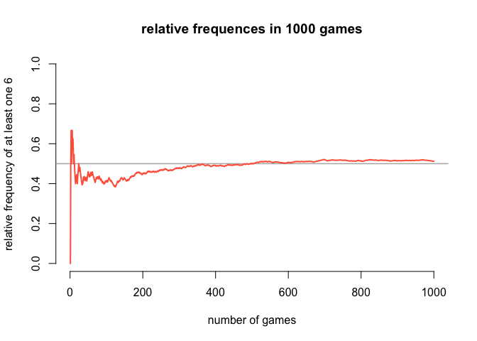
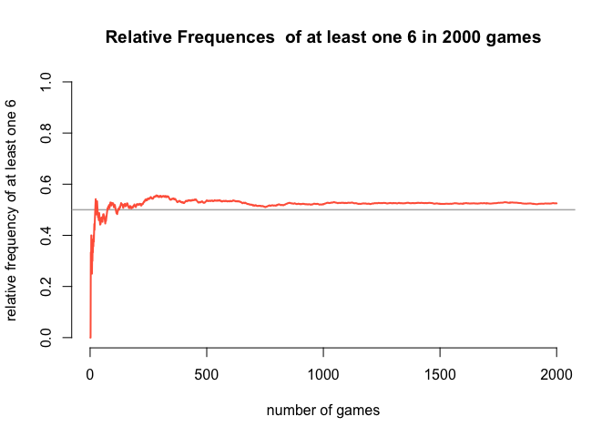
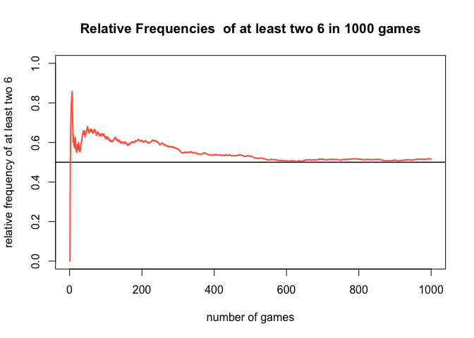

hw05-jilin-cao
================
caojilin
4/24/2018

De Mere’s problem Problem I

``` r
fair_die = die()
roll_4000 = roll(fair_die,4000)$rolls
roll_matrix = matrix(roll_4000,nrow = 1000,ncol = 4,byrow = TRUE)

#relative frequency of getting at least one 6
freqs = c()
for(i in 1:nrow(roll_matrix)){
  num_6 = length(which(roll_matrix[i,]==6))
  freqs = c(freqs,num_6)
}
freqs[which(freqs>=1)]=1
total = 1000
relative_freq = cumsum(freqs)/ 1:total
plot(1:total,relative_freq,ylim = c(0,1),xlab = "number of games",
     type = "n", bty="n",
     ylab = "relative frequency of at least one 6",
     main = paste("relative frequences in",total,"games"))
abline(h = 0.5, col = "gray70", lwd = 1.5)
lines(1:total, relative_freq, col = "tomato", lwd = 2)
```



``` r
roll_4000 = roll(fair_die,8000)$rolls
roll_matrix = matrix(roll_4000,nrow = 2000,ncol = 4,byrow = TRUE)

#relative frequency of getting at least one 6
freqs = c()
for(i in 1:nrow(roll_matrix)){
  num_6 = length(which(roll_matrix[i,]==6))
  freqs = c(freqs,num_6)
}
freqs[which(freqs>=1)]=1
total = 2000
relative_freq = cumsum(freqs)/ 1:total
plot(1:total,relative_freq,ylim = c(0,1),xlab = "number of games",
     type = "n", bty="n",
     ylab = "relative frequency of at least one 6",
     main = paste("Relative Frequences  of at least one 6 in",total,"games"))
abline(h = 0.5, col = "gray70", lwd = 1.5)
lines(1:total, relative_freq, col = "tomato", lwd = 2)
```

 Problem II

``` r
#simulate one game

# input two_roll
one_game_sim = function(){
  obj = list()
  for(i in 1:24){
    obj = c(obj,list(roll(fair_die,2)))
  }
  obj
}
one_game = one_game_sim()

count_2six_for_a_game = function(obj){
  num = 0
  for(i in 1:length(obj)){
    one_roll = obj[[i]]
    if(length(which(one_roll$rolls == 6)) == 2){
      num = num + 1
    }
  }
  return(num)
}
#1000 games simulation
total = 1000
freqs = numeric()
for(i in 1:total){
  curr = one_game_sim()
  freqs = c(freqs,count_2six_for_a_game(curr))
}
freqs[which(freqs >= 1)] = 1
relative_freq = cumsum(freqs)/ (1:total)

plot(1:total,relative_freq,ylim = c(0,1),xlab="number of games",
     main = paste("Relative Frequencies  of at least two 6 in",total, "games") , 
     type = "n",ylab = "relative frequency of at least two 6")
abline(h = 0.5,col="black",lwd=1.5)
lines(1:total,relative_freq,col="tomato",lwd = 2)
```


